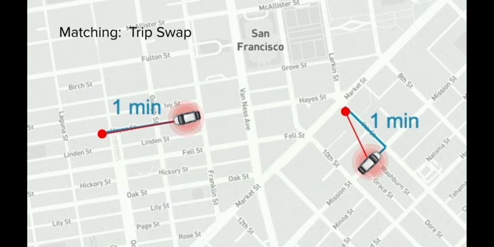

# CabEOS Smart Contracts (SC)

The Smart Contracts is entirely written in C++.

The main contracts for CabEOS are as follows:

* Auth
* Token
* Ride
* Wallet
* RIDEX

## System accounts
### Contract
* `toe1userauth`: TOE User Auth
* `toe1111token`: TOE Token
* `toe1111rtaxi`: TOE Ride Taxi
* `toe14rwallet`: TOE Ride Wallet
* `toe1111ridex`: TOE Ride Exchange (RIDEX)

### Others
* `bhubtoeindia`: Block.Hub TOE India (Token issuer)
* `bhubtoeinval`: Block.Hub TOE India Validator (by Company)
* ~~`toeridexsupp`: TOE RIDEX Supply~~ it is owned by RIDEX contract account itself
* `toeridesfees`: TOE Rides Fees: All the crypto commission is collected here.
* `toeridexfees`: TOE RIDEX Fees: All the trade fees is collected here.
* `toe11rreward`: TOE Ride Reward

## Contracts
* Auth
	- Action
		+ [x] creatifyuser
		+ [x] vbdricom
		+ [x] compvbvdator
		+ [x] deluser
		+ [x] sendalert (inline)
		+ [x] sendreceipt	(inline)
	- Table
		+ `users`
* Token
	- Action
		+ [x] create
		+ [x] issue
		+ [x] transfer
		+ [x] retire
		+ [x] open
		+ [x] close
		+ [x] setinflation
		+ [x] inflate
	- Table
		+ `stats`
		+ `accounts`

* Ride
	- Actions
		+ [x] addpaymost
		+ [x] create
		+ [x] assign
		+ [x] cancelbycom
		+ [x] cancelbydri
		+ [x] changedes
		+ [x] reachsrc
		+ [x] start
		+ [x] finish
		+ [x] addfareact
		+ [x] recvfare
		+ [x] sendalert (inline)
		+ [x] sendreceipt (inline)
		+ [x] eraseride 		// delete the ride entry, even if the rating is not done or will be done later. Bcoz, the RAM can't be consumed due to this delay.
	- Table	
		+ ridetaxi
	- Workflow (Explained):
		- Here, the ride table will be created by
			+ `addpaymost` (if the pay_mode chosen is crypto) or,
			+ `create`
		- And then destroyed using `erase` action.

* Govern
	- Actions
		+ [ ] createpoll 		// choices
		+ [ ] modify		// choices
		+ [ ] vote
	- Table-1 				// for conducting the poll
	- Table-2 				// showing the appointed leaders in the communities

> #### NOTES
>    - Here, contract to contract communication would happen like `Ride::finish()` >> `Token::transfer()`;

<!-- 
* `gen_otp` 
	- generate OTP
	- For unique OTP, link the rand no. corresponding to the hash generated from (
		+ `eos_ac_driver`, 
		+ `eos_ac_commuter`, 
		+ `timestamp`)
* `check_otp`

NOTE: Here, if this is implemented, then it has to be 
1. hashed & stored into the RAM table 				// 3649 -> "545435abf884....4548d3b"
2. encrypted & sent to the commuter				// "brfbdfjebd....fvfdv"
3. decrypted by commuter to say it to the driver		// 3649
4. the decrypted OTP will be checked with the hash (one stored 
		in the RAM table in step 1.)    // 3649 -> "545435abf884....4548d3b" == "545435abf884....4548d3b"
 
 -->

## Object
* Token
	- inflation
	- burn
* Ride
	- fare (fiat/crypto). crypto benefits:
		+ driver:
			- commission-free rides
			- weekly/monthly incentives (monitoring behavior)
		+ commuter:
			- surge-free rides
			- weekly/monthly incentives (monitoring behavior)
* Stake
	- Here, users will have to stake their token to get
		+ monthly/annually interest
		+ more no. of surge-free rides 
		+ commission-free rides

## Table (in Blockchain RAM)
* Token

* Ride
	- Here, each driver has a row dedicated in Blockchain DB (RAM)
	- When the ride is completed, then the data is moved to a Storage DB (redis type)
	- The row is created when the driver is in 2 stages - `enroute` & `on-trip` 
	- The row is deleted otherwise, i.e. `offline` & `open`
	- The table looks like this:

|driver_ac|ride_status|commuter_ac|lat_src|lon_src|lat_des|lon_des|book_timestamp|start_timestamp|finish_timestamp|fare_est|fare_act|pick_up_time|waiting_time|tip|driver_rating|driver_comment|commuter_rating|commuter_comment|
|---|---|---|---|---|---|---|---|---|---|---|---|---|---|---|---|---|---|---|
|---|---|---|---|---|---|---|---|---|---|---|---|---|---|---|---|---|---|---|
|---|---|---|---|---|---|---|---|---|---|---|---|---|---|---|---|---|---|---|
|---|---|---|---|---|---|---|---|---|---|---|---|---|---|---|---|---|---|---|

```
where,

driver_ac --> driver EOS account name
ride_status --> enroute/on-trip based on the ride.
commuter_ac --> commuter EOS account name
lat_src --> source location's latitude
lon_src --> source location's longitude
lat_des --> destination location's latitude
lon_des --> destination location's longitude
book_timestamp --> timestamp at which the booking is done.
start_timestamp --> timestamp at which ride starts
finish_timestamp --> timestamp at which ride is finished or cancelled.
fare_est --> estimate fare before the ride starts
fare_act --> actual fare after the ride finishes
pick_up_time --> time taken by the driver from current loc (at allotment time) to pick-up/source location.
waiting_time --> total waiting time during the ride. Basically, after the ride starts. 5 minutes is exempted (before the ride starts).
tip --> tip amount for the ride
driver_rating --> driver's rating for the ride
driver_comment --> driver's comment (if any)
commuter_rating --> commuter's rating for the ride
commuter_comment --> commuter's comment (if any)
```

* Stake
	- Here, the reason of staking is getting no. of rides i.e. `commission-free`/`surge-free`, which is an asset to a driver/commuter.
	- Each user (driver/commuter) has a row assigned like this:

	| user | type | token | rides |
	|------|------|-------|-------|
	| cabeos1111d1 | driver | 100 | 15 |
	| cabeos1111c3 | commuter | 20 | 40 |

```
where,

user --> a driver/commuter's account name
type --> driver/commuter
token --> platform's token
rides --> no. of available rides (commission-free/surge-free) to the driver/commuter respectively.
```


## Database (SQL, Redis)


## Algorithms
<!-- * __OTP generation algorithm__ -->

* __Incentive earning algorithm__
	- ride:
		+ commuter/driver needs to rate the ride asap. based on the timestamp difference (from ride finish_timestamp), the incentive would decrease.
	- governance:
		+ participating in governance via voting/election

* __Surge reduction model__

* __Ride allocation algorithm__
	- <u>pick-up time:</u> It depends on these 2 factors:
		+ driver's location
		+ congestion level

	- <u>Time swap:</u> When ride is requested, if 2 cabs are found to have this (img below) type of situation, where D1 is relatively far than D2 from C1 & viceversa for C2, then D2, D1 is assigned to C1, C2 respectively.

<p align="center">
	
</p>

* __Ride trading algorithm__
	- Driver is able to trade their available rides (commission-free) & make money out of it, depending on the market rate during buy/sell.
	- Commuter is able to trade their available rides (surge-free) & make money out of it, depending on the market rate during buy/sell.
	- Control factors are introduced to drive the asset's (i.e. ride) price by followings:
		+ No. of trips happening in the platform.
		+ Gas price


## Data Analysis (For customized experience)
* Show users the travel related Ads based on their trips.
	- if the trip is of `out-of-station` type, then show them 
		+ the best hotels for stay, partner with hotels or such platforms. Here, earn a percentage share.
		+ the best restaurants to eat, partner with them or such platforms. Here, earn a percentage share.


## Trials
* <u>Case-1:</u>
	- __Driver:__ Here, the driver's location is present in contract table with their ride_status as `open`, & they are trying to update the real-time location in Contract table.
	- __Commuter:__ The commuter when books the ride, gets the driver from the contract table based on nearby location & pick-up time.
	- __Constraints:__
		+ driver can finish it's account resources (RAM, CPU, NET) by constantly updating the real-time loc.
		+ If the commuter account's enough resources (CPU, NET) is getting used, then for assigning the ride, we will use another action to do. In this case, the contract's resources (CPU, NET) will be used. 
* <u>Case-2:</u>
	- __Driver:__ Here, the driver's location is present in external-db with their ride_status as `open`, & they are trying to update the real-time location in external-db.
	- __Commuter:__ The commuter when books the ride, gets the driver from the external-db based on nearby location & pick-up time.
	- __Constraints:__
		+ Here, the driver's account resources are intact, as it is communicating constantly with external-db, but not contract table. Also, the external-db has to be communicated with, inside the contract itself.
		+ If the commuter account's enough resources (CPU, NET) is getting used, then for assigning the ride, we will use another action to do. In this case, the contract's resources (CPU, NET) will be used. 


## NOTES (for Technical Whitepaper, Ricardian contracts)
* This notes is for writing the 
	- Technical Whitepaper
	- Ricardian contracts

### Payment mode
* The payment modes could be:
	- `crypto`: i.e. DApp's own cryptocurrency.
	- `fiatdigi`: i.e. National currency in digital mode.
	- `fiatcash`: i.e. National currency in cash mode.

* In the contract's table, all the fares (`fare_est`, `fare_act`) will be shown in national currency.
* Outside the contract, market conversion from `fare_est`/`fare_act` to `fare_crypto_est`/`fare_crypto_act` respectively, is done using CryptoMarket API.
* Inside the contracts' actions, whenever a commuter opts for `crypto` payment mode, then the equivalent amount of DApp's currency (i.e. `TOE`) at that timestamp as per the market rate (calculated outside before committing to the blockchain), is transferred to the Ride wallet (i.e. `ridewallet`) for auto-pay after the ride is completed successfully.
* Keeping market volatility in view, the `fare_crypto_act` is to be paid as calculated during setting the `fare_act`. Basically, conversion value calculated before setting into the Blockchain record, is considered.
* Any form of fare conversion is considered (outside) in 3 actions (in Blockchain Smart contracts) only:
	- `create`: create a ride | `fare_est` ---> `fare_crypto_est`
	- `changedes`: change destination location during the ride | `fare_est` ---> `fare_crypto_est`
	- `addfareact`: adding actual fare considering wait time, ride time in view | `fare_act` ---> `fare_crypto_act`

> NOTE: In order to avoid such obstacles, it is ensured that there is little extra balance maintained in the `ridewallet`, especially if the commuter is a frequent one.


### Voting
* Following topics are to be considered for voting among the community members (drivers, commuters):
	- The value for __fiat ---> crypto__ conversion in fare, is considered the one, which is calculated before setting into the Blockchain record.
		+ Q. Should the fare conversion be done during the dispersal i.e. `recvfare` action (inside)? 
			- For this, we can use `eos-api` codebase & market API inside the action.
		+ Q. Should the __fare_crypto_est__/__fare_crypto_est__ converted from __fare_est__/__fare_act__ be at Market price during __ride_request__ or __finish_ride__?
			- Need to be voted out for this decision. Most probably, we should go with __ride_request__. Or else, it's left with the community.
* A person can have more than one accounts. E.g. A __"validator"__ if wants to make ride, they can by creating a separate eosio account. But voting will be considered only for one account i.e. corresponding to profile hash.
* In Govern contract, the user types (driver/commuter/validator) will be eligible for different agenda.
	- E.g. For agenda-1, the voters eligible are driver/commuter.
	- E.g. For agenda-2, the voters eligible are commuter/validator. 

* References
	- [Anonymous Voting on Blockchain by cc32d9](https://github.com/cc32d9/cc32d9_ideas_for_EOSIO/blob/master/Anonymous_Voting_on_Blockchain.md)


### Ride Exchange (RIDEX)
* Here, Bancor Algorithm is going to be used just like used in EOS RAM price calculation.
* The ride (commission-free/surge-free) price is not going to be decided by the market maker, but rather via Bancor Algorithm.
* During lockdown situations, there will be no buy/sell of rides. This is to prevent price inflation in situation, where actually the platform is not being used. Because, the rides will be added to the ride_quota only if there is a finished ride.
* The ride no. will be added on every ride completion.
* There has to be some activity (ride, voting) every 6 months by the user in order to get the exact market price via sale. Just holding will not help. Otherwise, there will be a reduction (compared to market price) in the final sale price received by the seller. And then, the remaining amount will be transferred to the account - `toeridexfees`.
* Formula for `buyride`/`sellride` ACTION. When user wants to buy Ride (in no.), then the Ride price is calculated as:
```
Ride price (in TOE) = (n * quote.balance) / (n + base.balance)

where,
n = no. of Rides needed (in no.)
```


### CARES
* Customer Service Partners which are associated with the platform for doing the work assigned to them.
* Register & self-verify company validator account - `bhubtoeinval` as validator.
* The initial partners like `toepar111111`,... will be validated/verified by the Company itself. The concerned account - `bhubtoeinval`
* And these partners will further verify the drivers/commuters & eventually other new partners. Then this action - `compvbvdator` will be __DEPRECATED__ & the `bhubtoeinval` will be removed from the `users` table.
* Their works:
	- verify/blacklist the drivers (more strictly), commuters
	- attend to issues raised by drivers, commuters
	- conduct (schedule datetime) voting for any decision making. E.g. - deciding inflation rate, 

### Incentive model
* deduct Commuter's incentives based on the time taken to start the ride after (5 mins)
* deduct driver's incentives based on the time diff. (reachsrc_timestamp_est - reachsrc_timestamp_act) > threshold_val.............. i.e. crosses the permissible value i.e. 5 mins.
* deduction on commuter cancelling
* deduction on driver cancelling
* deduction (% wise in rating range below 4.8)
	- Harsh on lower ratings < 4 
	- Rating penalty algorithm
* deduction on care's helpers if they are rated low.
* deduction if (finish_timestamp_act - finish_timestamp_est) > threshold_value
* incentivize CARES partners more for validating the user fast (i.e. update_timestamp - auth_timestamp)
* deduction on commuter's reward & cancellation fee (in fiat) for cancellation (__"waiting"__ > __"enroute"__ > __"requested"__)
	- relatively lower on __"requested"__ ride status
	- relatively higher on __"enroute"__ ride status
	- relatively more higher on __"waiting"__ ride status
* deduction on driver's reward & cancellation fee (in fiat) for cancellation (__"waiting"__ > __"enroute"__ > __"requested"__)
	- relatively lower on __"requested"__ ride status
	- relatively higher on __"enroute"__ ride status
	- relatively more higher on __"waiting"__ ride status
* For commuter, all the incentives/rewards disbursed post-ride, will not be compared to a country's economy. But for driver, the incentive especially in case of ensuring ride during surge condition has to be sufficient enough, bcoz it will be compared w.r.t total value in fiat. After all, fiat currency is going to be used mostly within a nation to buy/sell commodities. 
* incentive on timely rating for commuter. This can be controlled via
	- <u>Driver</u> will give rating or else, their status will continue showing __"assign"__ & not be able to take any ride request (only assigned in case of __"online"__). 
	- <u>Commuter</u> may or may not give rating. But in order to make them rate, they have got 'x' hrs of wait_time (calculated from `addfareact_timestamp`) before it gets deleted from `ridestaxi` table. So, the faster the rating is done, the more will be incentives. 

### Driver status
* The ride status of drivers are listed in the `dridestatus` table.
* The accepted status: __"online"__, __"offline"__, __"assigned"__.
* During the ride, the status is changed at this action steps:
	- `addristatus`: after successful login, the status is could be changed to __"online"__/__"offline"__.
	- `assign`: status changed from __"online"__ to __"assigned"__.
	- `cancelbydri`: status changed from __"assigned"__ to __"online"__.
	- `addratebydri`: status changed from __"assigned"__ to __"online"__.

### Rating
* Rating is important to view a party's (driver/commuter/validator) performance in the platform.
* Bad rating & review is always done by a person. But, if the ride is good, then nobody cares to rate. Because may be, they expect some benefits from the platform. It's like working for the platform in order to run efficiently.
* So, for doing ratings they always expect something.
* But then, do they get something for making good reviews to each other (driver/commuter)?
  - NO

> NOTE: even if they mutually give good ratings to each other, they are __not incentivized__ for giving good ratings, but just for giving rating (good or bad) or doing the task.

* Having good ratings wouldn't help much in economic earning, but rather gaining opportunities like better & more rides.
	- for driver, having good rating is always a priority for ride-assign in same location range.
	- for a commuter, having good rating would get more offers (notification) like discounts (related to services by platform)...etc.
 This can be controlled via
	- <u>Driver</u> will give rating or else, their status will continue showing __"assign"__ & not be able to take any ride request (only assigned in case of __"online"__). 
	- <u>Commuter</u> may or may not give rating. But in order to make them rate, they have got 'x' hrs of wait_time (calculated from `addfareact_timestamp`) before it gets deleted from `ridestaxi` table. So, the faster the rating is done, the more will be incentives. 
* Initially, the rating_wait_time for commuter is set to 4 hrs (say). Then, the incentives will be broken into 4 pieces (say)
	- `incentive_1st hr` > `incentive_2nd hr` > `incentive_3rd hr` > `incentive_4th hr`
	- In this way, most commuters will probably start rating in may be 2 hrs.
	- Then, again the staggered incentives will be introduced, & then in this way. people will start rating just after the rides or at the earliest so as to not miss the highest possible incentives.

### Scalability
* The set of contracts are scalable to any no. of countries.
* For instance, `ridestaxi` table can have different scope like "india", "usa", ...
* And if the scope is already taken by a necessary parameter, then there can be another contract or table like in `toeuserauth` contract. The users info. w.r.t countries can be maintained in different tables.


### Ride
* A driver can have multiple rides (present in eosio table) in 2 cases:
	- pool ride
	- ride waiting for commuter to rate. Max. wait_time: 'x' hrs set in `rtststamp` table of `toeridetaxi` contract.
* A commuter shall always have only 1 ride (present in eosio table).
* The status of ride is continuously maintained by `ride_status` param in eosio table.
* A driver requires more (than commuter) EOSIO resources - RAM, CPU, NET in order to make a min. no. of ride for livelihood.

### Driver
* Consumes RAM in user auth table.
* Consumes RAM, CPU, NET in a ride.
* A driver has to wait for the finished ride to get erased & free the occupied space. Commuter gets some 'x' hrs to rate.
* A driver also has to store status info in form of eosio RAM.
* A driver consumes some RIDEX ride if opted.

### Commuter
* Consumes RAM in user auth table.
* Consumes RAM, CPU, NET in a ride.

### User Auth
* People will face camera & get their photo uploaded into server.
* People will give their fingerprint details.
* people will give the digital copy of national_id. Correspondingly the national id no. will be scanned. Or manually entered in case of issue. This will be matched by Validators during verification process.
* All the customer shall have national_id linked to multiple accounts creation. 
* The initial account creation by Company for a unique person shall be once either as Driver/Commuter/Validator.
* All the different params  will pass through Blockchain in form of image_hash, fingerprint_hash, national_id_hash. This will ensure user privacy in public chain.
* The validators are responsible for verifying/blacklisting registered user. And corresponding update the status as "verified" or "blacklisted" on-chain.

### Validator
* Validators are the member of TOE CARES, which is officially the customer care service provider built-in within the DApp.
* Their major works are as follows:
   - Verify/Blacklist user (driver/commuter)
   - Organize chat room for discussion regarding issues faced in community.
   - Schedule Voting related to decision-making.
   - Organize driver/commuter meetups for get-together, exposure.

* A validator loses its spot based on rating, no. of ratings. E.g. if a validator has less rating 4 (say), then the no. of ratings will be considered for staying or not staying in Top  Validators. And they will be given lesser priority in assigning customer-related issues. Then, they shall have the opportunity to earn back the top spots when the rating is good enough.
* In this way, the validators ensure in maintaining decentralized governance.

### Whitepaper
- Abstract
- Introduction
- Decentralization
  + Governance
  + Economics
  + Technology
- Blockchain Platform
- User Ecosystem
  + Driver
  + Commuter
  + Validator
- Features
- Tokenomics
   + distribution (in pie chart)
   + earnings
- Platform Workflow
  + Users sign-up
  + Company accounts creation (only if national_id is not available in DB) or else create on your own & supply
  + 
- MVP Demo
- Future
- References
- Glossary
- FAQ