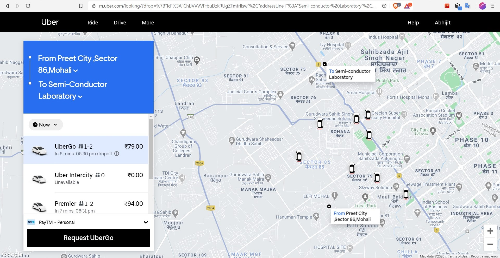
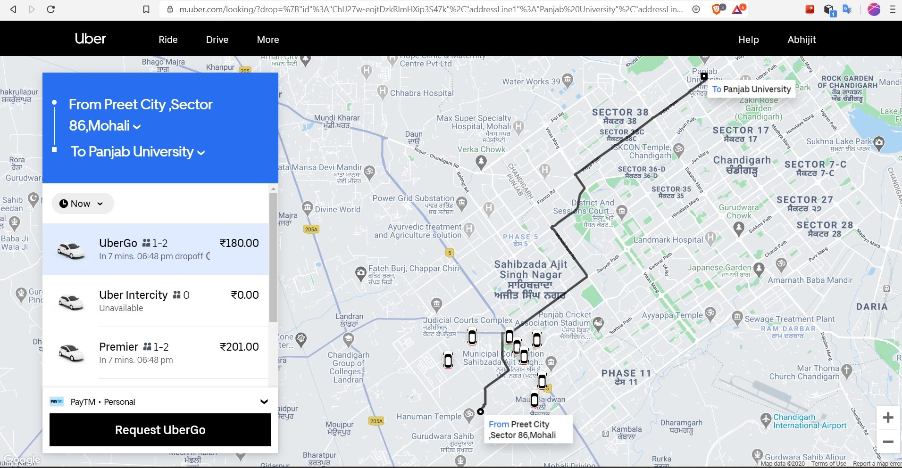

# Ride contract
## About
* It is a ride contract which is for 
	- [x] request ride by commuter
	- [ ] request pool ride by commuter(s)
	- [x] set separately pay_mode & pay_status for non-crypto modes
	- [x] assign ride to driver
	- [x] cancel ride by commuter/driver
	- [x] alerting commuter about vehicle has reached the pick-up location.
	- [x] start the ride
	- [x] finish the ride
	- [x] add actual fare after the ride is marked as complete
	- [x] driver receive payment just after the ride is finished.
	- [x] driver add/update the status (online/offline)
	- [x] sending alert
	- [x] sending receipt

## Contract
* contract name - `toeridetaxi`
* contract's account name - `toe1ridetaxi`

## Action
* `create`
* `setfipaymost`
* `assign`
* `cancelbycom`
* `cancelbydri`
* `changedes`
* `reachsrc`
* `start`
* `finish`
* `addfareact`
* `recvfare`
* `addristatus`
* `sendalert`
* `sendreceipt`

## Table
* `ridetaxi`
	- For each row, `ram_payer` could be:
		+ M-1: driver, commuters, contract for their part of data as per their action. 
		+ M-2: contract only for all the ride data.
would be users (driver/commuter) for their piece of data. TODO: 
	- if the ride is costing too much for their use, then additional amount of CPU, NET will be added to their account during account creation.
	- Here, the scope of the `ridestaxi` table is chosen as __contract name__ (i.e.`get_self().value` syntactically), because there are 2 parties (driver, commuter) involved. So, if either of the user is used as scope, then the other portion of the other user will not be shown. E.g. In other applications where the table row consists of more than 1 party, then it is always better to use __contract name__ as the table's scope.
	- the scope can be a country as well.... in order to separate the rides of different countries.
* `dristatus`
* `rtststamp`
* `rtsfuelprltr`

## Compile
```console
cabeos_contracts/toeridetaxi
$ eosio-cpp src/toeridetaxi.cpp -o toeridetaxi.wasm
Warning, empty ricardian clause file
Warning, empty ricardian clause file
Warning, action <create> does not have a ricardian contract
Warning, action <setfipaymost> does not have a ricardian contract
Warning, action <assign> does not have a ricardian contract
Warning, action <cancelbycom> does not have a ricardian contract
Warning, action <cancelbydri> does not have a ricardian contract
Warning, action <changedes> does not have a ricardian contract
Warning, action <reachsrc> does not have a ricardian contract
Warning, action <start> does not have a ricardian contract
Warning, action <finish> does not have a ricardian contract
Warning, action <addfareact> does not have a ricardian contract
Warning, action <recvfare> does not have a ricardian contract
Warning, action <addristatus> does not have a ricardian contract
Warning, action <sendalert> does not have a ricardian contract
Warning, action <sendreceipt> does not have a ricardian contract
Warning, action <eraseride> does not have a ricardian contract
Warning, action <create> does not have a ricardian contract
Warning, action <setfipaymost> does not have a ricardian contract
Warning, action <assign> does not have a ricardian contract
Warning, action <cancelbycom> does not have a ricardian contract
Warning, action <cancelbydri> does not have a ricardian contract
Warning, action <changedes> does not have a ricardian contract
Warning, action <reachsrc> does not have a ricardian contract
Warning, action <start> does not have a ricardian contract
Warning, action <finish> does not have a ricardian contract
Warning, action <addfareact> does not have a ricardian contract
Warning, action <recvfare> does not have a ricardian contract
Warning, action <addristatus> does not have a ricardian contract
Warning, action <sendalert> does not have a ricardian contract
Warning, action <sendreceipt> does not have a ricardian contract
Warning, action <eraseride> does not have a ricardian contract
```

> NOTE: Here, actions is repeating during compilation bcoz it is likely using multiple jobs. So, it prints multiple times.

## Deploy
* deploy contract
```
/toe_contracts/toeridetaxi
$ cleost set contract toe1ridetaxi ./ -p toe1ridetaxi@active
Reading WASM from /mnt/f/Coding/github_repos/toe_contracts/toeridetaxi/toeridetaxi.wasm...
Publishing contract...
executed transaction: 9acd19a54d1bc42c4476d0d15a2f1b0568ef3338b489d014170f6079bedef862  21624 bytes  8781 us
#         eosio <= eosio::setcode               {"account":"toe1ridetaxi","vmtype":0,"vmversion":0,"code":"0061736d01000000019f022860000060047f7f7f7...
#         eosio <= eosio::setabi                {"account":"toe1ridetaxi","abi":"0e656f73696f3a3a6162692f312e3100110a6164646661726561637400030964726...
warning: transaction executed locally, but may not be confirmed by the network yet         ]
```
	- EOS Resources usage:
		+ __RAM__: 715.41 KB
		+ __NET__: 21624 bytes
		+ __CPU__: 8781 us
	- Also, get to see the RAM consumption [here](https://jungle.bloks.io/transaction/9c3ea65b7e5f511ef44fec39adfaf79f87e1ecf81231e4b3cfa763d9396fc382?tab=ram-deltas) in "bloks.io" block explorer
* Adding eosio.code to permissions (for inline actions)
```
$ cleost set account permission toe1ridetaxi active --add-code
executed transaction: b97da9ceb63f41071bfa05282ef3d22207ca051306960eb0b8f4d2019de896df  184 bytes  324 us
#         eosio <= eosio::updateauth            {"account":"toe1ridetaxi","permission":"active","parent":"owner","auth":{"threshold":1,"keys":[{"key...
warning: transaction executed locally, but may not be confirmed by the network yet         ]
```


## Testing
* Test cases of different rides - create -> changedes
	- [ ] Case-1: crypto pay_mode
	- [ ] Case-2: fiatdigi pay_mode
	- [ ] Case-3: fiatcash pay_mode
	- [x] Case-4: crypto-crypto pay_mode
		+ `create`
		+ `assign`
		+ `reachsrc`
		+ `start`
		+ `changedes`
		+ `finish`
		+ `addfareact`
		+ `recvfare`
		+ `eraseride`
	- [ ] Case-5: crypto-fiatdigi pay_mode
	- [ ] Case-6: crypto-fiatcash pay_mode
	- [ ] Case-7: fiatdigi-crypto pay_mode
	- [ ] Case-8: fiatdigi-fiatdigi pay_mode
	- [ ] Case-9: fiatdigi-fiatcash pay_mode
	- [ ] Case-10: fiatcash-crypto pay_mode
	- [ ] Case-11: fiatcash-fiatdigi pay_mode
	- [ ] Case-12: fiatcash-fiatcash pay_mode

### A. Case-I (crypto): create ride by `toecom111111` in __crypto__ mode

#### Action - `create`
* prerequisites:
	- commuter should be verified user
	- if __"crypto"__ pay_mode, then fare_crypto_est should be transferred beforehand
* <u>Low balance in crypto wallet:</u>
```console
$ cleost push action toe1ridetaxi create '["toecom111111", "d362b4ab0413925388f778207c8de2a4af0b9f88204e9e6160c3f10d0a35bda2", "40e6a963269233d76eeadf5b9c373878eb6e70b9a3a07a372a2eee75b7060035", "5c513dcebaf81415ff93c17e545889f9807e23d7f5f6ad3819d7482e489a3ae8", "367b6a46f8d4c738ec5090a7828fdee6b441ff157744d907e41e6d26b3cf46b0", "toego", "crypto", "n", "79.00", 5.00", "17.8000 TOE", "1596732638", "2", "request a ride from home to office"]' -p toecom111111@active
Error 3050003: eosio_assert_message assertion failure
Error Details:
assertion failure with message: Sorry! Low balance in the ride wallet.
pending console output:
```
* create ride by `toecom111111` in __crypto__ mode
```console
$ cleost push action toe1ridetaxi create '["toecom111111", "d362b4ab0413925388f778207c8de2a4af0b9f88204e9e6160c3f10d0a35bda2", "40e6a963269233d76eeadf5b9c373878eb6e70b9a3a07a372a2eee75b7060035", "5c513dcebaf81415ff93c17e545889f9807e23d7f5f6ad3819d7482e489a3ae8", "367b6a46f8d4c738ec5090a7828fdee6b441ff157744d907e41e6d26b3cf46b0", "toego", "crypto", "n", "79.00", "5.00", "15.8000 TOE", "1597834838", "2", "request a ride from home to office"]' -p toecom111111@active
executed transaction: e5b67064795f194327aa1a682f9ff412c8816f9e82b1247fac605c0c59a34f63  320 bytes  365 us
#  toe1ridetaxi <= toe1ridetaxi::create         {"commuter_ac":"toecom111111","src_lat_hash":"d362b4ab0413925388f778207c8de2a4af0b9f88204e9e6160c3f1...
#  toe1ridetaxi <= toe1ridetaxi::sendreceipt    {"user":"toecom111111","message":"toecom111111 requested a ride."}
#  toecom111111 <= toe1ridetaxi::sendreceipt    {"user":"toecom111111","message":"toecom111111 requested a ride."}
warning: transaction executed locally, but may not be confirmed by the network yet         ]
```
	- trip related info: src loc & des loc
```md
- hashes of src, des lat & lon
d362b4ab0413925388f778207c8de2a4af0b9f88204e9e6160c3f10d0a35bda2
40e6a963269233d76eeadf5b9c373878eb6e70b9a3a07a372a2eee75b7060035
5c513dcebaf81415ff93c17e545889f9807e23d7f5f6ad3819d7482e489a3ae8
367b6a46f8d4c738ec5090a7828fdee6b441ff157744d907e41e6d26b3cf46b0

- "Preet City ,Sector 86,Mohali, Sector 86, Sahibzada Ajit Singh Nagar, Punjab": "30.6715713,76.701094"
- "Semi-conductor Laboratory, Department of Space, Govt. of India, Phase 8, Industrial Area, Sector 73, Phase 8, Industrial Area, Sahibzada Ajit Singh Nagar, Punjab": "30.703957,76.6999052"
- "finish_timestamp_est": "Wed, 19 Aug 2020 16:30:38 IST" i.e. 1597834838
```
	- For details of vehicle type with fare, please refer this [img](../images/fare/preet_city_to_scl_ride_request.png) [Link](https://www.uber.com/in/en/price-estimate/)
	- For conversion of INR to TOE: 5 Rs. --> 1.0000 TOE
	- Use [this](https://www.epochconverter.com/) for IST to Unix timestamp conversion


* `toecom111111` requested a ride again (with already previous ride ongoing) & gets error
```console
$ cleost push action toe1ridetaxi create '["toecom111111", "d362b4ab0413925388f778207c8de2a4af0b9f88204e9e6160c3f10d0a35bda2", "40e6a963269233d76eeadf5b9c373878eb6e70b9a3a07a372a2eee75b7060035", "5c513dcebaf81415ff93c17e545889f9807e23d7f5f6ad3819d7482e489a3ae8", "367b6a46f8d4c738ec5090a7828fdee6b441ff157744d907e41e6d26b3cf46b0", "toego", "crypto", "n", "79.00", "5.00", "15.8000 TOE", "1597834838", "2", "request a ride from home to office"]' -p toecom111111@active
Error 3050003: eosio_assert_message assertion failure
Error Details:
assertion failure with message: The ride looks like already set by 'toecom111111' using 'crypto'.
pending console output:
```
* Case-II (fiatdigi): create ride by `toecom111112` in __fiatdigi__ mode

#### Action - `addristatus`
* Set online status for driver
```console
$ cleost push action toe1ridetaxi addristatus '["toedri111111", "online"]' -p toedri111111@active
executed transaction: 412359b4b725a6ca5d185a1b8692872dcfb07537c5f7bdda2636fd8769fa2965  112 bytes  213 us
#  toe1ridetaxi <= toe1ridetaxi::addristatus    {"driver_ac":"toedri111111","status":"online"}
#  toe1ridetaxi <= toe1ridetaxi::sendreceipt    {"user":"toedri111111","message":"Your ride_status is updated to: 'online'."}
#  toedri111111 <= toe1ridetaxi::sendreceipt    {"user":"toedri111111","message":"Your ride_status is updated to: 'online'."}
warning: transaction executed locally, but may not be confirmed by the network yet         ]
```

#### Action - `assign`
* assign ride to driver: Facing an error, if the status is not present in the table
```console
$ cleost push action toe1ridetaxi assign '['toedri111111', 'ba63f8030b5ea976565fd509086e8221571cb05088ab8b968c071d9ef7c8b9e7', '1596930158']' -p toe1ridetaxi@active
Error 3050003: eosio_assert_message assertion failure
Error Details:
assertion failure with message: driver's status row is not present. Please, add using 'addristatus' action.
pending console output:
```
* assign ride to driver if the status is present in the table & the driver is online
```console
$ cleost push action toe1ridetaxi assign '['toedri111111', 'ba63f8030b5ea976565fd509086e8221571cb05088ab8b968c071d9ef7c8b9e7', '1596930158']' -p toe1ridetaxi@active
executed transaction: 9f2e7dd219b57ef18344450fa8d34509e700c1bca248fa4a878c2e260a038caa  136 bytes  203 us
#  toe1ridetaxi <= toe1ridetaxi::assign         {"driver_ac":"toedri111111","ride_id":"ba63f8030b5ea976565fd509086e8221571cb05088ab8b968c071d9ef7c8b...
#  toe1ridetaxi <= toe1ridetaxi::sendalert      {"user":"toedri111111","message":"toedri111111 is assigned with a ride."}
#  toe1ridetaxi <= toe1ridetaxi::sendalert      {"user":"toecom111111","message":"toecom111111 is assigned with a driver: toedri111111"}
#  toedri111111 <= toe1ridetaxi::sendalert      {"user":"toedri111111","message":"toedri111111 is assigned with a ride."}
#  toecom111111 <= toe1ridetaxi::sendalert      {"user":"toecom111111","message":"toecom111111 is assigned with a driver: toedri111111"}
warning: transaction executed locally, but may not be confirmed by the network yet         ]
```
	- trip related info: estimated time taken to reach the src
```
- "reachsrc_timestamp_est": "Sun, 09 Aug 2020 05:12:38 IST" i.e. 1596930158
```
* Error during re-assign the same ride
```console
$ cleost push action toe1ridetaxi assign '['toedri111111', 'ba63f8030b5ea976565fd509086e8221571cb05088ab8b968c071d9ef7c8b9e7', '1596930158']' -p toe1ridetaxi@active
Error 3050003: eosio_assert_message assertion failure
Error Details:
assertion failure with message: the commuter is already assigned with a driver: toedri111111. So, the ride can't be reassigned
pending console output:
```

#### Action - `reachsrc`
* `toedri111111` reach the src_loc
```console
$ cleost push action toe1ridetaxi reachsrc '["toedri111111", "ba63f8030b5ea976565fd509086e8221571cb05088ab8b968c071d9ef7c8b9e7"]' -p toedri111111@active
executed transaction: 4f33baaa9dc65d6ad00b1edbb524a11a8f146e7c4c5162f4330ff4bb7bb5ed9b  136 bytes  219 us
#  toe1ridetaxi <= toe1ridetaxi::reachsrc       {"driver_ac":"toedri111111","ride_id":"ba63f8030b5ea976565fd509086e8221571cb05088ab8b968c071d9ef7c8b...
#  toe1ridetaxi <= toe1ridetaxi::sendreceipt    {"user":"toedri111111","message":"toedri111111 has reached the pick-up point."}
#  toe1ridetaxi <= toe1ridetaxi::sendalert      {"user":"toecom111111","message":"Hello, toecom111111, your driver: toedri111111 has reached the pic...
#  toedri111111 <= toe1ridetaxi::sendreceipt    {"user":"toedri111111","message":"toedri111111 has reached the pick-up point."}
#  toecom111111 <= toe1ridetaxi::sendalert      {"user":"toecom111111","message":"Hello, toecom111111, your driver: toedri111111 has reached the pic...
warning: transaction executed locally, but may not be confirmed by the network yet         ]
```
* `toedri111111` retry the same action & gets error:
```console
$ cleost push action toe1ridetaxi reachsrc '["toedri111111", "ba63f8030b5ea976565fd509086e8221571cb05088ab8b968c071d9ef7c8b9e7"]' -p toedri111111@active
Error 3050003: eosio_assert_message assertion failure
Error Details:
assertion failure with message: Sorry! the ride_status is already marked as 'waiting'. So, you can't modify.
pending console output:
``` 

#### Action - `start`
* `toedri111111` start the ride
```console
$ cleost push action toe1ridetaxi start '["toedri111111", "ba63f8030b5ea976565fd509086e8221571cb05088ab8b968c071d9ef7c8b9e7", "n"]' -p toedri111111@active
executed transaction: cdd7711094d5920115e0d59354db78f485126f32f331b75a4ff1b05bafbc06ed  144 bytes  204 us
#  toe1ridetaxi <= toe1ridetaxi::start          {"driver_ac":"toedri111111","ride_id":"ba63f8030b5ea976565fd509086e8221571cb05088ab8b968c071d9ef7c8b...
#  toe1ridetaxi <= toe1ridetaxi::sendreceipt    {"user":"toedri111111","message":"toedri111111 starts the ride."}
#  toe1ridetaxi <= toe1ridetaxi::sendalert      {"user":"toecom111111","message":"toedri111111 starts the ride."}
#  toedri111111 <= toe1ridetaxi::sendreceipt    {"user":"toedri111111","message":"toedri111111 starts the ride."}
#  toecom111111 <= toe1ridetaxi::sendalert      {"user":"toecom111111","message":"toedri111111 starts the ride."}
warning: transaction executed locally, but may not be confirmed by the network yet         ]
```
* `toedri111111` retry the action & gets error:
```console
$ cleost push action toe1ridetaxi start '["toedri111111", "ba63f8030b5ea976565fd509086e8221571cb05088ab8b968c071d9ef7c8b9e7", "n"]' -p toedri111111@active
Error 3050003: eosio_assert_message assertion failure
Error Details:
assertion failure with message: Sorry! the trip is already started. So, you can't modify.
pending console output:
```

#### Action - `changedes`
* `toecom111111` change destination in b/w the ride
	- you can change the `pay_mode`. Note that __Case-2__ & __Case-4__ has to be checked outisde TOE SC, then only `changedes` action will be requested.
		+ Case-1: if the pay_mode is __"crypto"__ as previous:
			- then ensure that min __ridewallet__ balance is `fare_crypto_est` (converted from fiat @ Market price rate noted during ride request), or else prompt to send the required amount using `sendfare` func inside `toeridewallet` contract.
		+ Case-2: if the pay_mode is changed from __"crypto"__ to __"fiatdigi"__:
			- then ensure that min fiat __ridewallet__ balance is `fiat_est` (calculated using fiat calculator), or else prompt to send the required amount in __fiat__ wallet.
		+ Case-3: if the pay_mode is changed from __"fiatdigi"__ to __"crypto"__:
			- then ensure that min __ridewallet__ balance is `fare_crypto_est` (converted from fiat @ Market price rate noted during ride request), or else prompt to send the required amount using `sendfare` func inside `toeridewallet` contract.
		+ Case-4: if the pay_mode is __"fiatdigi"__ as previous:
			- then ensure that min fiat __ridewallet__ balance is `fiat_est` (calculated using fiat calculator), or else prompt to send the required amount in __fiat__ wallet.
	- Here, calculate the new __fare_est__ (using Fare calculator), __fare_crypto_est__ (converted @ MP during __ride_request__)
	- trip related info: src loc & des loc
```md
- hashes of new des lat & lon
7b598dfa7b2c9f051c2f55ef335e61b9911798a88773b27c60430deab84c21b3
b75f80aa9ac46065fe405df0b84908d8f0c689b9d1f344964efad64409e43a50

- "Preet City ,Sector 86,Mohali, Sector 86, Sahibzada Ajit Singh Nagar, Punjab": "30.6715713,76.701094"
- "Panjab University Sector 14, Chandigarh": "30.7580107,76.7662895"
- "finish_timestamp_est": "Sun, 09 Aug 2020 05:50:38 IST" i.e. 1596932438
- "fare_est": "180"
- "fare_crypto_est": "36.0000 TOE" i.e. 180/5, where MP --> 1 TOE = 5 INR
```

	- Error: low balance in the ride wallet
```console
$ cleost push action toe1ridetaxi changedes '["toecom111111", "7b598dfa7b2c9f051c2f55ef335e61b9911798a88773b27c60430deab84c21b3", "b75f80aa9ac46065fe405df0b84908d8f0c689b9d1f344964efad64409e43a50", "n", "180", "36.0000 TOE", "crypto", "change destination"]' -p toecom111111@active
Error 3050003: eosio_assert_message assertion failure
Error Details:
assertion failure with message: Sorry! Low balance in the ride wallet. Please, transfer '18.0000 TOE'.
pending console output:
```
	- After transferring required TOE tokens to `ridewallet`, successfully changed destination
```
$ cleost push action toe1ridetaxi changedes '["toecom111111", "7b598dfa7b2c9f051c2f55ef335e61b9911798a88773b27c60430deab84c21b3", "b75f80aa9ac46065fe405df0b84908d8f0c689b9d1f344964efad64409e43a50", "n", "180", "36.0000 TOE", "crypto", "change destination"]' -p toecom111111@active
executed transaction: b13b7a930cacb1ba1d30f1b94f2461b365dae7d17f74ce7d3577d41cc1de6739  224 bytes  227 us
#  toe1ridetaxi <= toe1ridetaxi::changedes      {"commuter_ac":"toecom111111","des_lat_hash":"7b598dfa7b2c9f051c2f55ef335e61b9911798a88773b27c60430d...
#  toe1ridetaxi <= toe1ridetaxi::sendreceipt    {"user":"toecom111111","message":"toecom111111 changes the destination location & the fare is update...
#  toe1ridetaxi <= toe1ridetaxi::sendalert      {"user":"toedri111111","message":"toecom111111 changes the destination location & the fare is update...
#  toecom111111 <= toe1ridetaxi::sendreceipt    {"user":"toecom111111","message":"toecom111111 changes the destination location & the fare is update...
#  toedri111111 <= toe1ridetaxi::sendalert      {"user":"toedri111111","message":"toecom111111 changes the destination location & the fare is update...
warning: transaction executed locally, but may not be confirmed by the network yet         ]
```
* `toecom111111` change destination with the same lat & lon and gets error:
```console
$ cleost push action toe1ridetaxi changedes '["toecom111111", "7b598dfa7b2c9f051c2f55ef335e61b9911798a88773b27c60430deab84c21b3", "b75f80aa9ac46065fe405df0b84908d8f0c689b9d1f344964efad64409e43a50", "180", "36.0000 TOE", "crypto", "change destination"]' -p toecom111111@active
Error 3050003: eosio_assert_message assertion failure
Error Details:
assertion failure with message: Sorry, both modified latitude & longitude are same as its stored counterpart.
pending console output:
```


#### Action - `finish`
* `toedri111111` finish ride
```console
$ cleost push action toe1ridetaxi finish '["toedri111111"]' -p toedri111111@active
executed transaction: 55593174ee6c644ef1c8f188e654a91cd591109a6daa0a53cb833cbee24ded2c  104 bytes  704 us
#  toe1ridetaxi <= toe1ridetaxi::finish         {"driver_ac":"toedri111111"}
#  toe1ridetaxi <= toe1ridetaxi::sendalert      {"user":"toedri111111","message":"toedri111111 finishes the ride."}
#  toedri111111 <= toe1ridetaxi::sendalert      {"user":"toedri111111","message":"toedri111111 finishes the ride."}
warning: transaction executed locally, but may not be confirmed by the network yet         ]
```
* `toedri111111` retries the action and gets error:
```console
$ cleost push action toe1ridetaxi finish '["toedri111111"]' -p toedri111111@active
Error 3050003: eosio_assert_message assertion failure
Error Details:
assertion failure with message: Sorry! the ride by the driver is already marked as complete.
pending console output:
```

#### Action - `addfareact`
* `toedri111111` adds actual fare & fare_crypto (considering MP during ride request)
	- data
```json
"fare_act": "190"	// considering extra time
"fare_crypto_act": "38.0000 TOE"		// converting from fare_act @ MP during request_ride
```
	- push action
```console
$ cleost push action toe1ridetaxi addfareact '["toedri111111", "190", "38.0000 TOE"]' -p toedri111111@active
executed transaction: 68e0cc0a09ccc5ea77d390cd3a29ff24b59ad5e0655d8880f7ce60c1b10774d5  120 bytes  309 us
#  toe1ridetaxi <= toe1ridetaxi::addfareact     {"driver_ac":"toedri111111","fare_act":"190.00000000000000000","fare_crypto_act":"18.0000 TOE"}
#  toe1ridetaxi <= toe1ridetaxi::sendreceipt    {"user":"toedri111111","message":"toedri111111 adds the actual fare in INR & TOE"}
#  toe1ridetaxi <= toe1ridetaxi::sendalert      {"user":"toecom111111","message":"Now toecom111111 has to pay 190.000000 (in INR) or 18.0000 TOE (in...
#  toedri111111 <= toe1ridetaxi::sendreceipt    {"user":"toedri111111","message":"toedri111111 adds the actual fare in INR & TOE"}
#  toecom111111 <= toe1ridetaxi::sendalert      {"user":"toecom111111","message":"Now toecom111111 has to pay 190.000000 (in INR) or 18.0000 TOE (in...
warning: transaction executed locally, but may not be confirmed by the network yet         ] 
```
* `toedri111111` retries the action and gets error:
```console
$ cleost push action toe1ridetaxi addfareact '["toedri111111", "190", "18.0000 TOE"]' -p toedri111111@active
Error 3050003: eosio_assert_message assertion failure
Error Details:
assertion failure with message: Sorry! the actual fare is already set. You can't modify
pending console output:
```

#### Action - `recvfare`
* `toedri111111` receives `fare_crypto_act` from the ridewallet contract which has wallet owned by `toecom111111`
```console
$ cleost push action toe1ridetaxi recvfare '["toedri111111", "receives fare for finishing a ride"]' -p toedri111111@active
executed transaction: ffb2a1f18a30bb5d23a2d8487847881378f013c710f7a6785105ac6fd29acae4  136 bytes  506 us
#  toe1ridetaxi <= toe1ridetaxi::recvfare       {"driver_ac":"toedri111111","memo":"receives fare for finishing a ride"}
#  toe14rwallet <= toe14rwallet::disburse       {"receiver_ac":"toedri111111","wallet_holder":"toecom111111","quantity":"18.0000 TOE","memo":"receiv...
#  toe1111token <= toe1111token::transfer       {"from":"toe14rwallet","to":"toedri111111","quantity":"18.0000 TOE","memo":"ridewallet disburses 18....
#  toe14rwallet <= toe14rwallet::sendalert      {"user":"toecom111111","message":"ridewallet of 'toecom111111' is deducted by 18.0000 TOE amount."}
#  toe14rwallet <= toe14rwallet::sendalert      {"user":"toedri111111","message":"toedri111111 recieves 18.0000 TOE amount for purpose: receives far...
#  toe14rwallet <= toe1111token::transfer       {"from":"toe14rwallet","to":"toedri111111","quantity":"18.0000 TOE","memo":"ridewallet disburses 18....
>> Either money is not sent to the contract or contract itself is the commuter.
#  toedri111111 <= toe1111token::transfer       {"from":"toe14rwallet","to":"toedri111111","quantity":"18.0000 TOE","memo":"ridewallet disburses 18....
#  toecom111111 <= toe14rwallet::sendalert      {"user":"toecom111111","message":"ridewallet of 'toecom111111' is deducted by 18.0000 TOE amount."}
#  toedri111111 <= toe14rwallet::sendalert      {"user":"toedri111111","message":"toedri111111 recieves 18.0000 TOE amount for purpose: receives far...
warning: transaction executed locally, but may not be confirmed by the network yet         ]
```
	- view the ridewallet balance of commuter - `toecom111111`
```console
$ cleost get table toe14rwallet toecom111111 ridewallet
{
  "rows": [{
      "balance": "18.8001 TOE"
    }
  ],
  "more": false,
  "next_key": ""
}
```
* `toedri111111` tries to recive the fare again & gets error:
```console
$ cleost push action toe1ridetaxi recvfare '["toedri111111", "receives fare for finishing a ride"]' -p toedri111111@active
Error 3050003: eosio_assert_message assertion failure
Error Details:
assertion failure with message: Sorry! the crypto fare for completed ride to driver: toedri111111 is already transferred.
pending console output:
```

#### Action - `eraseride`
* erase ride of `toecom111111` 
```console
$ cleost push action toe1ridetaxi eraseride '["toecom111111", "erase ride after the fare is transferred"]' -p toe1ridetaxi@active
executed transaction: 350112062f1ff1af78c9015b43f2c55eadcf931762cfc0f730474f99f12d0231  144 bytes  932 us
#  toe1ridetaxi <= toe1ridetaxi::eraseride      {"commuter_ac":"toecom111111","memo":"erase ride after the fare is transferred"}
warning: transaction executed locally, but may not be confirmed by the network yet         ]
```

## TODO
* [ ] addrating action
	- here, the `dristatus` would be changed from "assigned" to "online"
* [ ] Can `finish`, `addfareact`, `recvfare` be merged into one action by automatically transferring the money after adding the actual fare. 
* [ ] Implement pool ride. Ensure that the `dridestatus` table is only modified when the ride is not pool type. This is because, when in pool, the "online" to "assigned" is not true for the next commuter to be picked-up. For the next commuter also, the driver's status should be "online", but not "assgined".

### NOTES
* All the actions are ensured to process sequentially based on checking the `ride_status` field of the table, so that an action can't be accessed before using the previous required action. E.g. `cancelbycom` can only be accessed in __"requested"__, __"enroute"__, __"waiting"__ ride status.
*	addfareact action is not used as inline inside finish action bcoz there are some external factors like waiting time, route etc,...(to be fetched from traditional Database) involved in fare calculation.
* `toeridetaxi` contract is linked:
	- via `disburse` (as an inline action inside `toeridetaxi::recvfare` action) to `toeridewallet` contract
	- via `addridequota` (as an inline action inside `toeridetaxi::finish` action) to `toeridex` contract

* additional `ride_quota` gets increased only if the ride is marked __"complete"__ & the pay_mode chosen is __"crypto"__.
* Fare disbursement to driver after finished ride:
	- "fiatdigi": 25% commission
	- "fiatcash": 25% commission
	- "crypto": 25% commission
	- "crypto" with RIDEX: 0% commission
* Based on `ridex_userstatus_com` == 'y', outside SC, the fare_est would be surge-free.
* Based on `ridex_userstatus_dri` == 'y', outside SC, the recv_fare_act would be commission-free.
*	Anything stored back into server:
	- after erase action (called after `cancel` or `addfareact` or `recvfare`)
* `ride_id` created by hashing these 2 params:
	- commuter_ac
	- timestamp at ride creation
* ride rating will be done via `toeridetaxi` contract.
*	Ride rating:
	- M-1: if rating for a ride is not done within 'x' hours, then the person don't get chance to rate later & gets his own `ride_rating_todo` decreased by 1.
		+ cons: what would be the opponent's rating then.
	- M-2: rating done via `toeuserauth` contract. At any point of time, the rating is done for a past ride.
```cpp
	ACTION addrating( const name& user,
						checksum256 ride_id,
						uint32_t 
						uint32_t addfareact_timestamp,
						float rating)

```
		+ cons: if accessed from CLI, then how to check if the ride_id is legit. bcoz the ride data is no more available in the contract table, but rather moved to storage DB.
* Commuter shall always have 1 row in the table. Because, it can't book another ride until the rating_wait_time is over after finishing the current ride.
* But driver can have many rides in 2 cases:
	- pool ride
	- the finished ride waiting for commuter to rate & then it will be erased. Or the time elapsed (since `addfareact` action) is >= rating_wait_time & then the ride gets deleted.